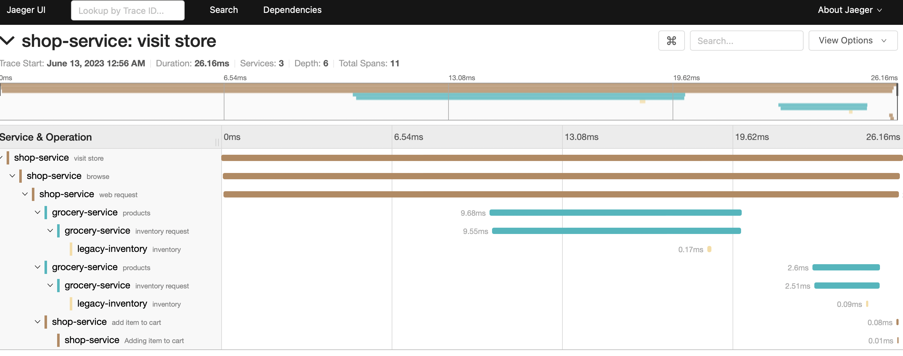
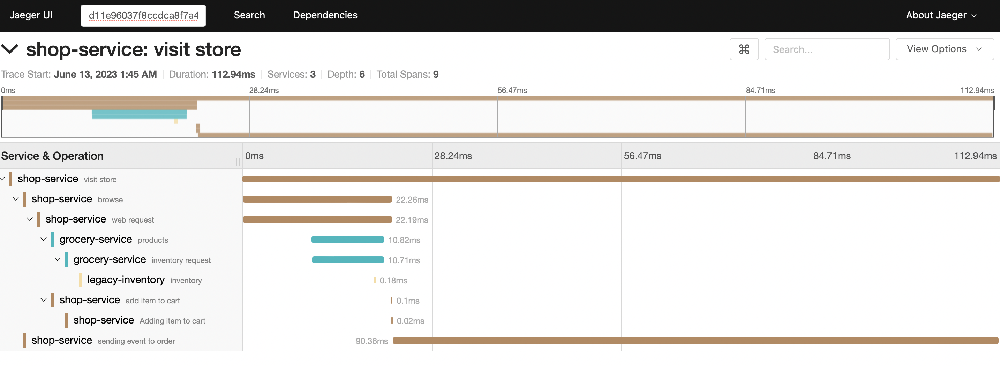

# Observability with for Python app with OpenTelemtry api 

CMD:

python grocery_store.py
python legacy_inventory.py
python shopper.py
python order.py

Then check jaeger UI

Without Kafka

With Kafka

